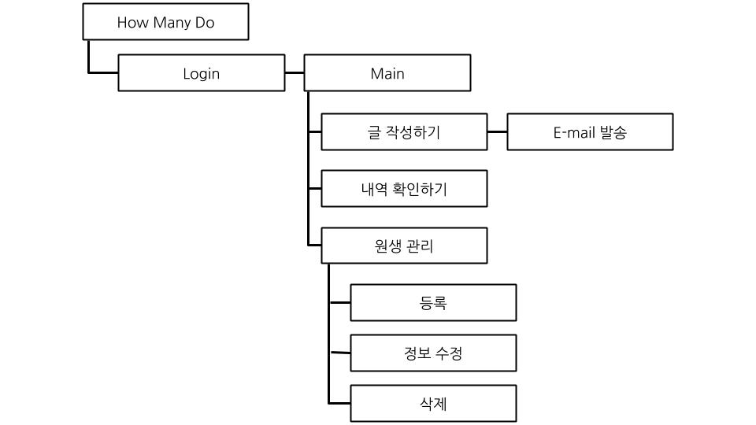

## 삼육대학교 
#### 윈도우 프로그래밍 기말과제
#### 소프트웨어 2015100902 김현균 

# 기말 프로젝트 기획서  How Many Do

## 1. 프로그램 개요
- How Many Do는 학원을 다니는 수강생의 부모님께 수업진행상황을 알려주는 윈도우 프로그램입니다.

- Admin은 학원의 선생님이 글을 작성하는 부분이며, 로그인을 통해 접속할 수 있습니다.
  또한, 수강생마다 사진을 첨부한 글을 작성할 수 있으며 그 내역을 확인할 수 있습니다.
 
##  2. 기능 구성도

## 3. 처리 파일 설계
 - RegistedMember : 등록되어 있는 학생 정보 리스트 (정보 : 학생 이름, 학생 생년월일, 학부모 이름, 아이디, 비밀번호)
 - WritedFile : Admin이 작성한 글(날짜, 학생 이름, 본문내용, 사진)파일
 - ListWriteFile : Admin이 작성한 글이 정리되어 있는 List 파일

## 4. 사용자 인터페이스
### - Admin

##### Write by K_Sanbal
