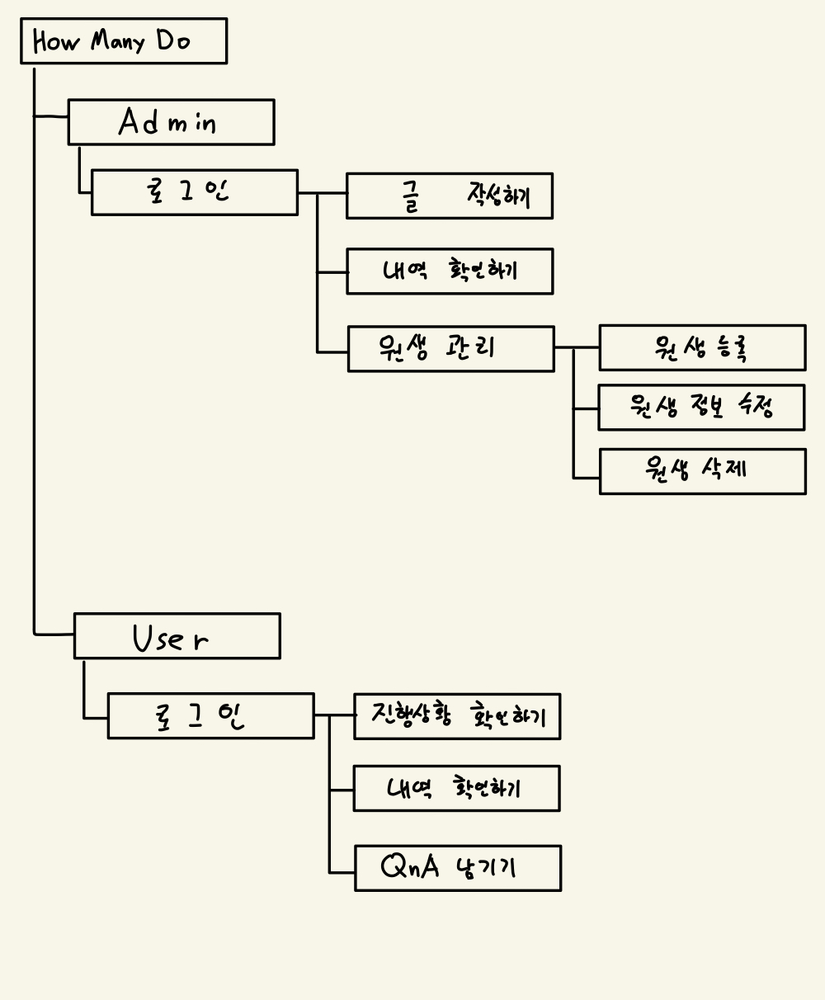

#### 삼육대학교 윈도우 프로그래밍 기말과제
##### Write by K_Sanbal
# 기말 프로젝트 기획서

## - How Many Do
1. How Many Do는 학원을 다니는 수강생의 부모님께 수업진행상황을 알려주는 윈도우 프로그램입니다.
2. Admin은 학원의 선생님이 글을 작성하는 부분이며, 로그인을 통해 접속할 수 있습니다.
 또한, 수강생마다 사진을 첨부한 글을 작성할 수 있으며 그 내역을 확인할 수 있습니다.
3. User는 학원의 선생님이 작성한 글을 볼 수 있는 부분이며, 로그인을 통해 접속할 수 있습니다.
 자신의 학생만의 글을 볼 수 있으며, 그 내역을 조회할 수 있습니다.
 그 외에도 피드백이나 QnA가 가능합니다.
 
##  - 기능 구성도

## - 처리 파일 설계

## - 사용자 인터페이스